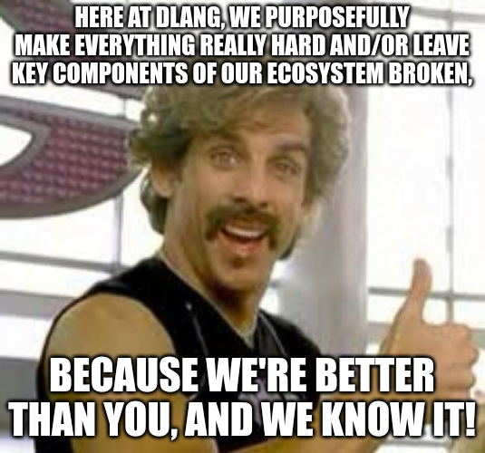

<h1>Trogdor</h1>

<strike>I didn't have a better name.</strike>

<b><u>I don't need a better name</u></b>

Incomplete (and likely will be incomplete for many moons) <a href="http://hl7.org/fhir/">FHIR</a> implementation in <a href="https://dlang.org">D</a>.

<h5>
</h5>

<h2>Contributor's guide</h2>
<b>Steps:</b>
<ul>
<li>Make sure it runs. Preferrably <a href="https://www.youtube.com/watch?v=y4usE2RePqo">fast.</a>
<li>If the code is bad we'll figure it out. Pretty much nobody I know has written D code before. Frankly, most of what's here now is probably bad.
</ul>

<h2>Quickstart</h2>
<ul>
    <li>Draw an S, for Snake. Er, Dragon, er. Whatever.</li>
    <li>Next, we'll draw a <i>more different</i> S.</li>
    <li>For the head, put a top mark on a long V.</li>
    <li>Then you add some legs, throw on a couple arms...</li>
</ul>

<h2>Okay, okay. <b>Actual</b> quickstart:</h2>
<ul>
<li>It's not ready to be used.</li>
<li><code>dub</code>, D's package manager, is not updated to use fresh <code>glibc</code> versions. Meaning I can't use <code>dub</code> on my super cool fresh install of Fedora.</li>
<li>Which means you need to compile it from source using <code>ldc2</code>.
<li>This really isn't much of a quickstart...</li>
<li>Don't try to use this yet.</li>
</ul>

<h1>Why use D...?</h1>

It's a simple and easy to hate answer.

Despite <i>White Goodman</i>'s concise explanation above, there is more to say here. D is a <b>great</b> language. It <strike>stole</strike> <b>borrowed</b> the elements of Java that allow clean and readable code, without being pigeon-holed into 500 <code>class</code> files, 30 <code>enum</code> files, and less-than-great performance. At any point in time I can simply do away with the garbage collector and operate at the same, if not faster speeds than C++. I <b><u>love</u></b> that.

<h3>TL;DR</h3>
<ul>
<li>Code go fast like speed racer!</li>
<li>Optional garbage collector. Can manage memory manually as I'm accustomed to with C++.</li>
<li>You do not need to be <i><a href="https://en.wikipedia.org/wiki/Dan_Brown">Dan Brown</a></i> to understand any of the source code.</li>
<li>SYSTEMS PROGRAMMING WITHOUT <code>::</code> SYNTAX.

<h6>I do not expect anyone to use this, even when it's "complete". It's a learning exercise for me. I chose my favorite language to add that extra bit of oomf to the free-time I'm spending.</h6>